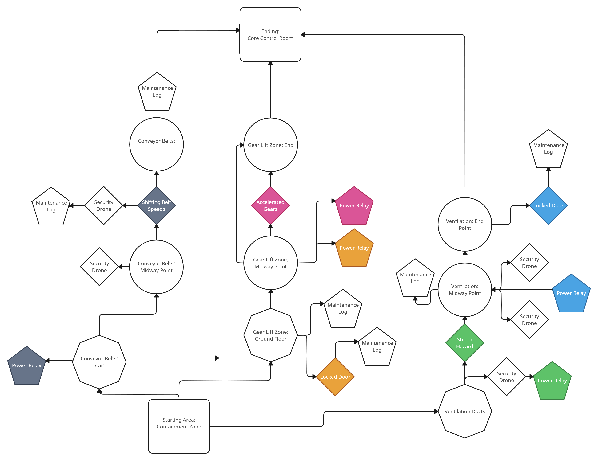

## Mechanics Inferno  
**Role: Solo Designer (Level Design • Scripting • Lighting • Audio • Playtesting)**  
*Built in Unreal Engine 5.4*

---

## Design Premise  
This level started with a question:  
**Can space and timing do the heavy lifting for onboarding players to a mechanic-driven environment?**

Mechanics Inferno explores how to teach environmental systems through layout and visual/sound cues. While it includes basic dialog and UI prompts, the goal was to lean on design-driven communication wherever possible—especially in hazard escalation and spatial flow.

---

## Core Design Goals  
- **Push Clarity Through Layout**: Use timing, structure, and lighting as the first language  
- **Support With Light UI**: Use prompts/dialog where necessary, but aim to reduce reliance on them  
- **Escalate Like a Song**: Teach a beat, disrupt it, remix it  
- **Deliver Mechanical Trust**: Design hazards that feel fair and consistent, even at high speed

---

## Pitch & Loop  
You’re dropped into a vertical factory on the brink of meltdown. Every room pulses with danger. Systems that seem simple—conveyors, steam, lifts—build into layered hazards. You climb, reroute power, dodge timing traps, and learn as you go.

> **[Insert Image: Gif or image pair of safe conveyor setup → later compound version with steam or gear overlays]**

---

## Blockmesh & Planning  
The entire level is stacked vertically and split into three interconnected paths. Each route teaches different mechanical rhythms, before converging into a final layered run. I used a bubble diagram to map flow, backtracking, and sightlines.

> **[Insert Image: Top-down or vertical blockout with route highlights]**

---

## Hazard Design: Readability First  
Each system started simple, then evolved into challenge and remix.

### 🔁 Conveyors  
- Movement-altering floors  
- Added lighting strips and audio clunks for clarity  

### 💨 Steam Vents  
- Timed barriers  
- Early versions too subtle—reworked with buildup hissing and stutter-light  

### 🕰️ Gear Lifts  
- Rotating elevators  
- Tuned for readable arcs and jump timing  

> **[Insert Image: Annotated hazard timing rhythm or safe vs unsafe window]**

---

## Relay Stations – Systems In Motion  
The Power Relay mechanic adds soft puzzle gating and forces movement decisions.

- Temporarily powers off obstacles or opens a path  
- Encourages scanning the space for clues before activating  
- Created a feedback loop: hit → race → recover

  
> **[Insert Image: Shot of activated relay powering down a hazard temporarily]**

---

## Visual & Audio Atmosphere  
Everything is handled with lighting tone, emissive flicker, and layered audio loops.

- Start floor is dim and eerie  
- Mid level grinds and pulses with hazard lights  
- Final section is overloaded with heat, energy, and pressure

> **[Insert Image: Comparison gif of early-floor lighting vs late-floor red glow]**

---

## Communicating Systems (With & Without UI)  
There are dialog and UI prompts where needed—this wasn’t a UI-free experiment. But the level was built to teach using environment first.

Examples:
- **Steam vent audio builds tension before danger**  
- **Safe relays pulse light on countdown**  
- **Line-of-sight gives early warning to most dangers**

---

## Tester Feedback  
Relays were originally unclear—timing and payoff weren’t visible. I added clear pulses and red/green emissives. Playtesters adjusted fast after that. Most players understood hazard rhythms within one full loop of each route.

<iframe width="560" height="315" src="https://www.youtube.com/embed/qZTmgnhKmmA" title="Tester Playthrough" frameborder="0" allowfullscreen></iframe>

---

## Full Breakdown – Design in Motion  
### 🎥 Video Presentation  
<iframe width="560" height="315" src="https://www.youtube.com/embed/TD54-gFbFfI" frameborder="0" allowfullscreen></iframe>

### 🎥 Blockmesh Tour  
<iframe width="560" height="315" src="https://www.youtube.com/embed/c5y4U_emVuA" frameborder="0" allowfullscreen></iframe>

### 🎥 Bonus Mechanic Breakdown  
<iframe width="560" height="315" src="https://www.youtube.com/embed/x4WSnCKTy6U" frameborder="0" allowfullscreen></iframe>

### 🎥 Hazard Presentation  
<iframe width="560" height="315" src="https://www.youtube.com/embed/9c-bqo-3bUk" frameborder="0" allowfullscreen></iframe>

---

## Tools Used  
- **Engine:** Unreal Engine 5.4  
- **Pre-planning:** Sweet Home 3D, RPG Map Maker 2  
- **All scripting, layout, visuals, sound** handled solo

---

## References  
1. **Figure 1** – DALL·E. (2024). *AI-generated factory exterior and mood shots.*  
2. **Figure 2** – Sega. *Gene Gadget Zone conveyor belt reference.* Sonic 3D Blast  
3. **Figure 3** – Konami. *Rotating gear towers.* Castlevania: Portrait of Ruin  
4. **Figure 4** – Plexi. (2023). *Sci-fi vent shafts.* Steam Workshop  
5. **Figures 5–8** – OpenAI. (2024). *Generated environment concept art.*  
6. **Figure 9** – Sweet Home 3D. *3D layout mockup for factory.*  
7. **Figure 10–11** – Deepnight’s RPG Map Maker 2  

---

## Final Thoughts  
This project wasn’t about polish—it was about **communication**. Could I make a level that teaches, escalates, and challenges without overwhelming the player? Mechanics Inferno proved that with enough visual rhythm and smart layout, players can learn and adapt fast—even with rough edges.

> **[Insert Image: Final platform with player reaching Core Control Room]**
