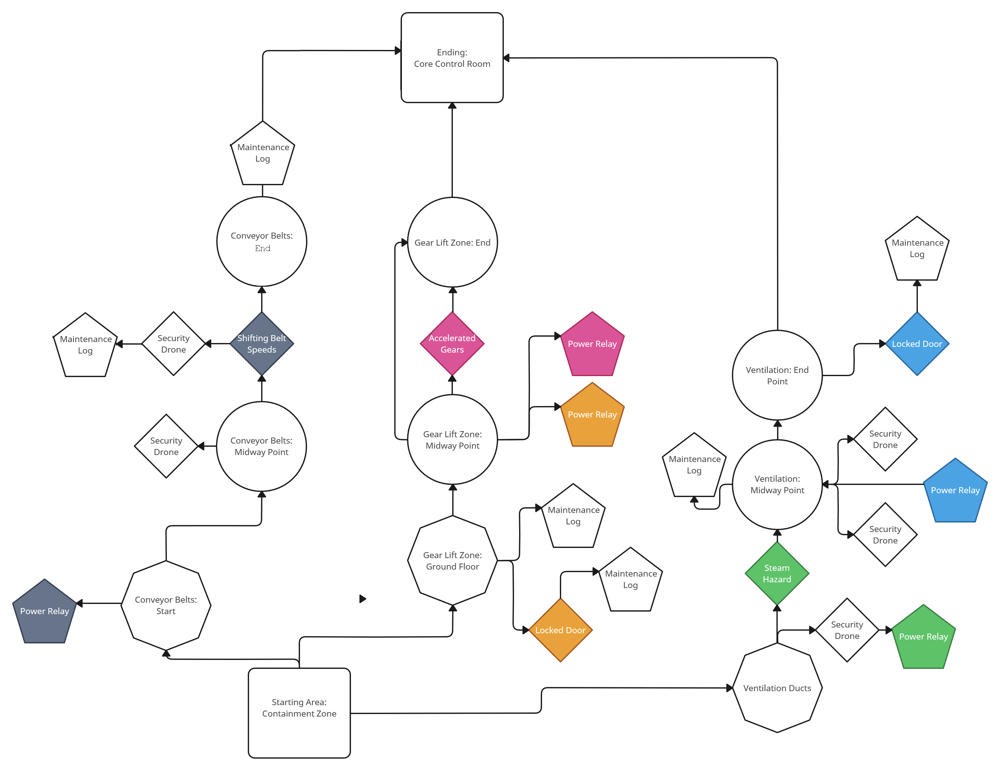
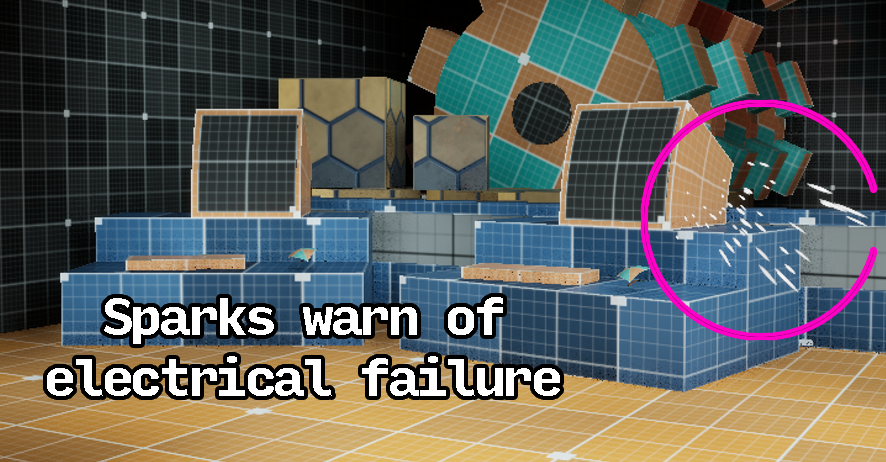
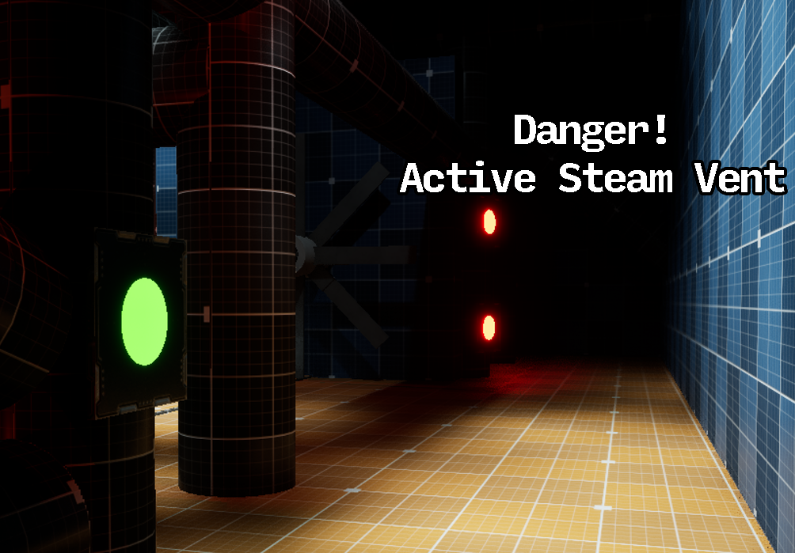
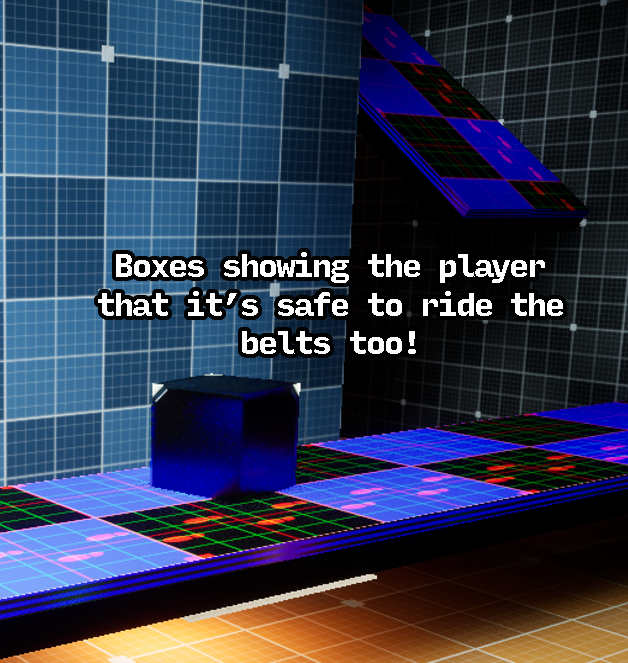

## Overview
Mechanic's Inferno is an immersive atmospheric platformer level set within a high-stakes industrial facility on the brink of disaster. Players are challenged to navigate a labyrinth of mechanical hazards, leveraging strategic thinking and precise timing to overcome environmental obstacles. Inspired by iconic factory and machinery levels from classic games, the design focuses on skillful movement, adaptive strategies, and engaging puzzle elements as players race to avert catastrophe in the Core Control Room.

## Video Presentation

<iframe width="560" height="315" src="https://www.youtube.com/embed/TD54-gFbFfI" frameborder="0" allowfullscreen></iframe>

## Blockmesh Presentation

<iframe width="560" height="315" src="https://www.youtube.com/embed/c5y4U_emVuA" frameborder="0" allowfullscreen></iframe>

<iframe width="560" height="315" src="https://www.youtube.com/embed/x4WSnCKTy6U" frameborder="0" allowfullscreen></iframe>

## Mechanic Presentation

<iframe width="560" height="315" src="https://www.youtube.com/embed/9c-bqo-3bUk" frameborder="0" allowfullscreen></iframe>

## Tester Playthrough

<iframe width="560" height="315" src="https://www.youtube.com/embed/qZTmgnhKmmA" frameborder="0" allowfullscreen></iframe>

## Level Story
The facility’s machinery has turned hostile after a catastrophic failure, with safety barriers activated to prevent further destruction. As the protagonist, you must ascend the factory’s floors, navigating through a maze of dangers to reach the Core Control Room and shut down the rogue systems before it’s too late. Each floor presents escalating challenges that test your reflexes, timing, and problem-solving abilities, culminating in a high-stakes showdown at the heart of the facility.

## Level Description
3D, First-Person, Platformer, Set against the backdrop of a gritty, industrial factory, Mechanics Inferno offers a multi-floor platforming experience. Each level is intricately designed with mechanical complexity, from moving conveyor belts to towering gear lifts, creating a dynamic and hazardous environment. Players must master three distinct paths with unique challenges and optional objectives, all converging at the Core Control Room.

- **Main Objective:** Reach the Core Control Room to disable the rogue systems and prevent disaster.
- **Paths:** Three unique routes, each with tailored obstacles and rewards, all intertwined and required for completion.
- **Obstacles:** Moving conveyor belts, rotating gear lifts, and pressurized steam barriers test timing and adaptability.
- **Collectibles:** Scattered throughout the level, these reward exploration.

## Key Level Mechanics
1. **Conveyor Belts:** These moving platforms alter player movement, requiring careful timing and precision to navigate without being pulled into hazards.
2. **Power Relay Stations:** Located at critical junctures, these stations allow players to temporarily disable obstacles like steam barriers or reactivate dormant machinery, opening new pathways.
3. **Gear Lifts:** Rotating gears serve as makeshift elevators, demanding precision jumps and careful timing to avoid being thrown off-course.
3. **Fans & Steam Vents:** Player pushing fans and steam vents designed to force the player to time progression for to find another way around.

## Bubble Diagram
To visualize the flow of *Mechanics Inferno*, a bubble diagram was created, illustrating the level’s multi-floor structure, pathways, and key mechanics. Each path offers unique challenges, leading the player through hazards and collectibles, converging at the Core Control Room.

## Mood Boards
The level’s tone evolves as players ascend. The initial areas are dim and filled with the eerie stillness of inactive machinery. Midway, players encounter the deafening sounds of grinding gears and roaring steam, while the final control room is an ominous, energy-filled space that underscores the stakes of the mission. This progression amplifies tension and immersion, pulling players into the factory’s relentless rhythm.

## Sample Visual Cues

## Development Tools
- **Engine:** Unreal Engine 5.4
- **Additional Software:** Sweet Home 3D, RPG Map Maker 2 for initial layout concepts
- **Art Style:** Industrial, gritty, and atmospheric with a focus on immersive lighting and environmental storytelling.

## References
1. **Figure 1** - DALL·E. (2024). *Generated imagery for level environments and factory exterior.* OpenAI.
2. **Figure 2** - Sega *A wide conveyor belt in Gene Gadget Zone Act 3.* In *Sonic 3D Blast*. Retrieved from [https://sonic.fandom.com/wiki/Conveyor_Belt](https://sonic.fandom.com/wiki/Conveyor_Belt)
3. **Figure 3** - Konami *Rotating gears, Medusa Heads, and spikes in Tower of Death.* In *Castlevania: Portrait of Ruin*. Retrieved from [https://castlevania.fandom.com/wiki/Tower_of_Death](https://castlevania.fandom.com/wiki/Tower_of_Death)
4. **Figure 4** - Plexi. (2023). *Ventilation Shaft (scifi).* In *Plexi's Workshop*. Retrieved from [https://steamcommunity.com/sharedfiles/filedetails/?id=2274932193](https://steamcommunity.com/sharedfiles/filedetails/?id=2274932193)
5. **Figures 5-8** - OpenAI. (2024). *AI-generated imagery for starting, ending, and key areas of the level.* DALL·E.
6. **Figure 9** - Sweet Home 3D *3D level design for factory layout.* Retrieved from [SweetHome3D.com](https://www.sweethome3d.com).
7. **Figures 10-11** - Deepnight *Top-down map with objectives.* RPG Map Maker 2. Retrieved from [https://deepnight.net/tools/rpg-map/](https://deepnight.net/tools/rpg-map/)

**Pixabay** General sound effects [Audio files]. Retrieved November 2024, from https://pixabay.com/
**reesound** General sound effects [Audio files]. Retrieved November 2024, from https://freesound.org/

**Source is currently uploading**